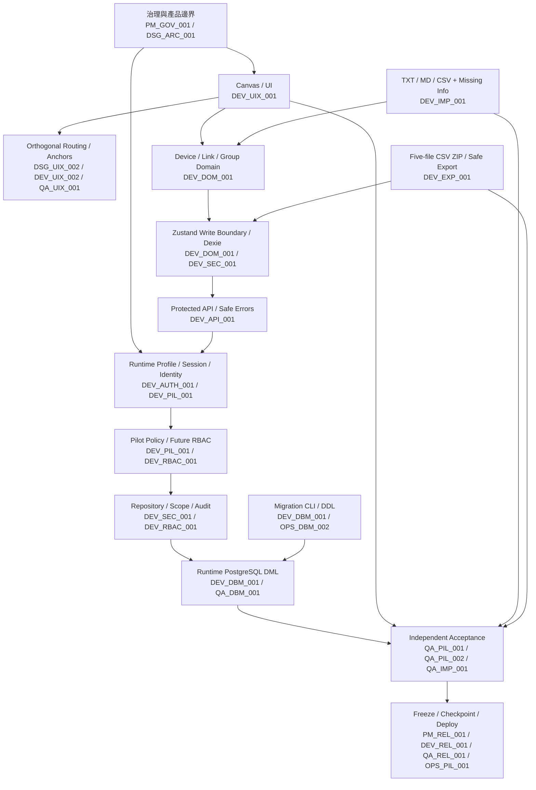

# NetTopo Studio 架構與 Ticket Map

## 2026-09-11 AIL 雙軌整理擴充（D33）

- 發展分支與狀態請先看 [BRANCH-MAP.md](BRANCH-MAP.md)。
- [功能／欄位基線](C:/Users/DUS/Desktop/project/nettopo-studio/.local/worktrees/ai-layout-poc/docs/engineerticket/contracts/TOPOLOGY-FUNCTION-DATA-MAP.md) 與 [雙軌對接契約](C:/Users/DUS/Desktop/project/nettopo-studio/.local/worktrees/ai-layout-poc/docs/engineerticket/contracts/AI-LAYOUT-DUAL-TRACK-HANDOFF.md) 為本輪設計開發入口。
- 共用資料路徑：Project snapshot → 快速本地策略／智慧模型意圖 → layout core → 既有 router/scorer → preview → revision/permission guard → Zustand → Dexie/server repository。
- PM_AIL_001 → DSG_AIL_001 → DEV_AIL_001/002 → DEV_AIL_003 → QA_AIL_001 → QA_AIL_002；AI 只協助圖面呈現，不修改網路設備或防禦配置。

- 狀態：`DSG_ARC_001 READY／使用者已核准`
- 核准日期：2026-08-19

前期設計與開發單號的逐項對照另見 [DESIGN-DEVELOPMENT-MAP.md](DESIGN-DEVELOPMENT-MAP.md)。

所有模組在設計或修改前，必須先通過 [REQUIREMENT-BASELINE.md](REQUIREMENT-BASELINE.md) 的歷史追溯、衝突與回歸檢查。

## 產品邊界

NetTopo Studio 的核心是網路拓樸建模、文件轉換、缺失資訊辨識、安全交換與內部協作。漏洞掃描、Wazuh、SIEM 與自動防禦 Agent 屬於 `netNNassist`，不得混入本 Ticket Map。

## 架構分層圖



## 分層責任與不可跨越規則

| Layer | Primary Tickets | 權威資料／責任 | 禁止事項 |
|---|---|---|---|
| Governance | PM_GOV_001, DSG_ARC_001 | 產品目標、批准、架構邊界 | 推薦不得視為批准 |
| UI／Canvas | DEV_UIX_001 | React Flow controlled view、Inspector | UI 不決定權限；不直接持久化 |
| Link Routing | DSG_UIX_002, DEV_UIX_002 | 直角路徑、設備避障、最近邊 anchor、重疊 lane offset | 不把視覺 anchor 寫回 Device／Link domain；不得穿越設備 |
| Domain | DEV_DOM_001 | `Project = Device[] + Link[] + Group[]` | Credential 不得進 Project |
| State／Storage | DEV_DOM_001, DEV_SEC_001 | Zustand action；Dexie local；PostgreSQL server | Component 不直接寫 Dexie；拓樸不回 localStorage |
| Import | DEV_IMP_001 | Parser、Zod、Preview、Missing Info | Preview 前不得寫入；blocking 不可強制略過 |
| Export | DEV_EXP_001 | 固定五檔、safe default、round-trip | Pilot full 預設禁用；不得輸出 secret |
| Auth／Session | DEV_AUTH_001, DEV_PIL_001 | Runtime profile、allowlist、session | Pilot/production 不接受 demo/dev header |
| API | DSG_API_002, DEV_API_001 | Auth-first、validated query、safe error、no-store | 未登入不得先 parse business input；不得只用 source scan 取代 Handler 行為驗證 |
| Policy／Repository | DEV_PIL_001, DEV_RBAC_001 | Server-side scope、transaction、audit | Route 不自行拼 RBAC SQL |
| Credential | DEV_SEC_001 | Separate API/table、encrypted write、masked read | 不回 plaintext/ciphertext/nonce |
| Runtime DB | DEV_DBM_001 | `DATABASE_URL`、DML、schema verify | 不讀 SQL、不 DDL、不 migrate、不 seed |
| Migration | DEV_DBM_001, OPS_DBM_002 | `MIGRATION_DATABASE_URL`、SQL、checksum、lock | 不 fallback；已發布 migration 不可修改 |
| QA | QA_* | 獨立驗收與證據 | 不修改產品程式；環境阻擋不能標 pass |
| Release | PM_REL_001, DEV_REL_001, QA_REL_001 | Freeze、snapshot、checkpoint、tree equivalence | QA 未通過不得部署 |

## Runtime Profile Map

| Profile | Ticket | 用途 | 身分來源 | 資料限制 |
|---|---|---|---|---|
| development | DEV_AUTH_001 | 本機開發 | gated demo session／loopback dev identity | Demo data only |
| test | QA_* | 自動化驗證 | test fixture | Isolated fixture |
| pilot | DEV_PIL_001 | 內網工程試用 | temporary pilot session 或後續 OIDC | Synthetic data only |
| production | DEV_OIDC_001 | 正式部署 | OIDC | 正式規則，未啟動 |

## Checkpoint 分解

```text
[DEV_AUTH_001] feat(dev-gate)
→ [DEV_DBM_001] refactor(db): separate migration and runtime boundaries
→ [DEV_SEC_001] fix(credentials)
→ [DEV_API_001] fix(api): auth-first and safe errors
→ [DEV_PIL_001] feat(pilot-auth)
→ [DEV_IMP_001] feat(transfer/import-contract)
→ [DEV_EXP_001] feat(transfer/export-contract)
→ [DEV_UIX_001] feat(import-ui) 的未封存部分
→ [DEV_UIX_002] feat(ui-routing) 的未封存部分
→ [QA_REL_001] test(pilot) / docs(pilot)
```

真正執行拆分前必須先完成 `PM_REL_001`，建立 freeze list；不能直接依本圖開始 staging。
