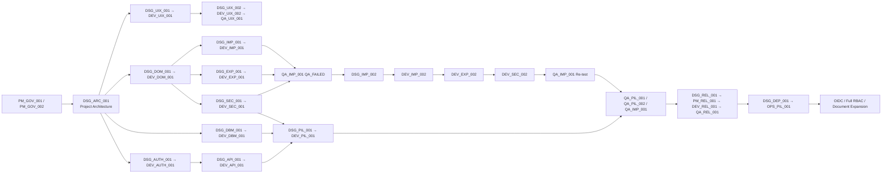

# 前期設計／開發單號對照

- 建立日期：2026-08-17
- 用途：讓設計組、開發組與測試組用同一組 Ticket ID 辨識功能鏈。
- 原則：設計票完成不等於開發獲准；開發票必須獨立達到 `READY` 才能動工。

## 完整工作鏈

| 順序 | 架構／功能 | 設計 Ticket | 設計狀態 | 開發／維運 Ticket | 實作狀態 | 後續驗收 Ticket |
|---:|---|---|---|---|---|---|
| 01 | 產品憲章與架構邊界 | `DSG_ARC_001` | READY／已核准 | `PM_GOV_001`, `PM_GOV_002` | READY／已生效 | — |
| 02 | Canvas／Auto-layout／Workspace UI | `DSG_UIX_001` | DONE | `DEV_UIX_001` | DONE | 既有 UI 測試 |
| 02A | 直角避障路由／最近邊 Anchor／Overlap Offset | `DSG_UIX_002` | DONE | `DEV_UIX_002` | QA_PASSED | `QA_UIX_001` QA_PASSED |
| 03 | Domain／Zustand／Dexie／多拓樸 | `DSG_DOM_001` | DONE | `DEV_DOM_001` | DONE | 既有 domain/storage 測試 |
| 04 | 文件匯入與 Missing Info | `DSG_IMP_001` | DONE | `DEV_IMP_001` | QA_RETURNED | `QA_IMP_001` QA_FAILED |
| 05 | CSV Bundle／Safe Export | `DSG_EXP_001` | DONE | `DEV_EXP_001` | QA_RETURNED | `QA_IMP_001` QA_FAILED |
| 06 | Credential／Secret Boundary | `DSG_SEC_001` | DONE | `DEV_SEC_001` | READY_FOR_QA | `QA_PIL_001`, `QA_IMP_001` |
| 06A | CSV v2 strict contract 修正 | `DSG_IMP_002` | READY | `DEV_IMP_002`, `DEV_EXP_002`, `DEV_SEC_002` | DEV_IMP_002 READY；DEV_EXP_002／DEV_SEC_002 BLOCKED | `QA_IMP_001` 同票 Re-test |
| 07 | Development Gate | `DSG_AUTH_001` | DONE | `DEV_AUTH_001` | QA_PASSED | Checkpoint 時由 `QA_REL_001` 重驗 |
| 08 | Migration／Runtime Boundary | `DSG_DBM_001` | DONE | `DEV_DBM_001` | QA_PASSED | `QA_DBM_001` 真實 DB 驗收 |
| 09 | API Auth-first／Safe Error | `DSG_API_001` | DONE | `DEV_API_001` | QA_PASSED | `QA_API_001` QA_PASSED |
| 09A | Audit API 詳細 request／limit／error／test contract | `DSG_API_002` | DONE | `DEV_API_001` | QA_PASSED | `QA_API_001` QA_PASSED |
| 10 | Audit／Logging／Health | `DSG_OBS_001` | DONE | `DEV_API_001`, `DEV_SEC_001`, `DEV_PIL_001` | 部分候選實作 | `QA_API_001`, `QA_PIL_001` |
| 11 | 正式跨站 RBAC | `DSG_RBAC_001` | DEFERRED | `DEV_RBAC_001` | DEFERRED | `QA_RBAC_001` |
| 12 | Internal Pilot／OWASP 邊界 | `DSG_PIL_001` | DONE | `DEV_PIL_001` | READY | `QA_PIL_001`, `QA_PIL_002` |
| 13 | Freeze／Checkpoint 拆分 | `DSG_REL_001-R1` | READY | `PM_REL_001`, `DEV_REL_001` | PM READY／DEV IN_PROGRESS | `QA_REL_001` BLOCKED |
| 14 | Pilot DB／HTTPS／部署 | `DSG_DEP_001` | PROPOSED | `OPS_DBM_001`, `OPS_DBM_002`, `OPS_SEC_001`, `OPS_PIL_001` | DB 啟動、Role 分離、Secret 修復 READY_FOR_QA／部署待規劃 | `QA_DBM_001` READY value-based re-test, `QA_PIL_002` BLOCKED |
| 15 | Entra OIDC／正式 Session | `DSG_OIDC_001` | DEFERRED | `DEV_OIDC_001` | DEFERRED | `QA_OIDC_001` |
| 16 | DOCX／XLSX／PDF／OCR | `DSG_DOC_001` | DEFERRED | `DEV_DOC_001`, `DEV_DOC_002` | DEFERRED | 待未來建立 QA_DOC Ticket |

## 依賴圖



## 設計工單交付規則

每張 `DSG_*` 工單至少要交付：

- 架構或流程圖。
- Domain／API／CSV／DB 欄位契約。
- In Scope、Out of Scope。
- 錯誤與安全邊界。
- 預計修改檔案與依賴方向。
- 測試地圖與放行條件。
- 真正需要使用者確認的最少決策。

設計完成後狀態只能是 `WAITING_APPROVAL`；若過去工作已由使用者批准、實作並驗證，才可回填為 `DONE`。

## 開發工單啟動規則

每張 `DEV_*` 工單開始前必須確認：

1. 對應 `DSG_*` 已完成。
2. 所引用 Decision ID 是 `APPROVED`。
3. 開發 Ticket 本身是 `READY`。
4. 依賴 Ticket 已 `DONE` 或符合票面指定狀態。
5. 沒有其他組正在修改相同高衝突檔案；若有，先由 PM 排序。

## 高衝突檔案與 Primary Ticket

| 檔案 | Primary Ticket／切分方式 |
|---|---|
| `app/page.tsx` | UI、Pilot、Import/Export 必須依 hunk 分別歸 DEV_UIX_001／DEV_PIL_001／DEV_IMP_001／DEV_EXP_001 |
| `app/lib/topology-routing.ts` | 直角避障、anchor、lane／channel offset 歸 DEV_UIX_002；不得混入 Domain schema 變更 |
| `app/lib/topology-layout.ts` | Layout ordering 歸 DEV_UIX_001；link endpoint／channel offset 重構歸 DEV_UIX_002 |
| `app/lib/topology-store.ts` | Domain persistence 歸 DEV_DOM_001；credential strip 歸 DEV_SEC_001；import apply 歸 DEV_IMP_001 |
| `app/lib/topology-transfer.ts` | Import contract 歸 DEV_IMP_001；export/ZIP 歸 DEV_EXP_001；secret boundary 歸 DEV_SEC_001 |
| `db/topology-postgres.ts` | Migration boundary 歸 DEV_DBM_001；credential 歸 DEV_SEC_001；Pilot scope 歸 DEV_PIL_001；正式 RBAC 歸 DEV_RBAC_001 |
| `app/api/*` | Auth-first 歸 DEV_API_001；Pilot session/policy 歸 DEV_PIL_001；credential response 歸 DEV_SEC_001 |
| `package.json`／lock | dependency 必須跟實際使用它的 primary Ticket 同行 |

## 現在執行中的 P0 路徑

```text
DSG_IMP_002
CSV Bundle v2 strict exchange contract 已核准，作為 DEV_IMP_002／DEV_EXP_002／DEV_SEC_002 的唯一設計基線

DEV_IMP_002 → DEV_EXP_002 → DEV_SEC_002
DEV_IMP_002 已可開工；DEV_EXP_002／DEV_SEC_002 依票面依賴解除後接續，不得跳過順序

QA_IMP_001 Re-test
修正票全部 READY_FOR_QA 後，保留首輪 QA_FAILED 並重跑完整 Browser／round-trip／secret acceptance
```

`QA_IMP_001` 因 v2 五檔、duplicate filename、sharing consistency 與 pre-read size gate 失敗；PM 已以 D23 確認退件成立，Release 持續 blocked。
