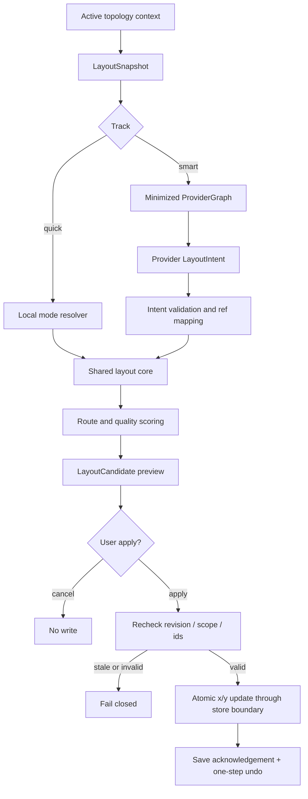
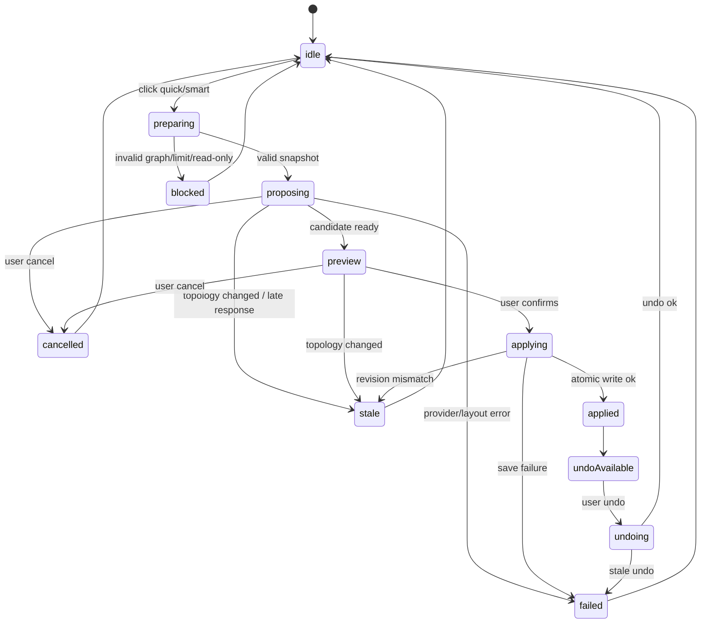

# AI Layout Detailed Contract — 雙軌整理資料、UI 與套用邊界

- Primary Ticket：DSG_AIL_001
- Development Branch：codex/ai-layout-poc
- Worktree：C:/Users/DUS/Desktop/project/nettopo-studio/.local/worktrees/ai-layout-poc
- Base Commit：1b0b084518886cda347f175bfc959401fd1d18ed
- Integration Target：codex/dev-rel-001-checkpoint
- Decision Baseline：PM_GOV_001-D33
- Status：READY（2026-09-12 PM scope review 通過；DEV 實作依票面排程）
- Revision：R1 after PM review
- Updated：2026-09-12

## 1. 目的與硬邊界

本契約把「快速整理」與「智慧整理」收斂成同一條安全、可測試的座標候選流程。

首期只允許改動既有 `Device.x` / `Device.y`，不得改：

- device/link/group 的 id、name、type、kind、from/to、groupId 或其他拓樸語意欄位。
- Customer、TopologyRecord.siteId、owner、creator、role、permission。
- credentials、masked credentials、audit secret metadata。
- route points、lane、dock、asset path 或 AI job metadata 的 durable schema。
- JSON／CSV bundle schema、PostgreSQL migration 或 demo/pilot/auth policy。

快速整理必須可離線運作；智慧整理第一版只在 server/Pilot synthetic provider 通道啟用。純 Dexie/local storage 模式保留 quick，smart 顯示 unavailable，不建立付費 proposal、不假裝 server scope 已驗證。未設定 provider、provider 失敗或 budget 關閉時，不得影響快速整理。

## 2. 固定 pipeline



Pipeline invariant：

1. Proposal 階段不得寫 Project、Dexie 或 PostgreSQL。
2. Preview 中的 candidate 是未信任資料，Apply handler 必須重驗。
3. Apply 只能以完整 device id 集合中的既有 id 更新座標；本期採完整 positions contract，每個 existing device id 必須恰好一筆。
4. Late response、cancelled request、active topology 切換、baseRevision 不一致，一律標 stale 並拒絕套用；`graphHash` 只作幾何/cache 輔助，不可替代 baseRevision。
5. Undo 只回復本次 layout 操作的座標 delta，不回寫整份舊 Project。

## 3. TypeScript 資料契約

以下型別是 DEV 實作的最小公共語意；實際檔案可拆分，但欄位語意不得放寬。

```ts
type LayoutTrack = "quick" | "smart";
type LayoutMode = "auto-detect" | "three-tier" | "spine-leaf" | "layered";
type LayoutDirection = "left-to-right" | "top-to-bottom";
type LayoutObjective =
  | "balanced"
  | "reduce-crossings"
  | "group-by-function"
  | "keep-backbone-centered"
  | "compact";

type GeometryVersion = {
  source: "base-178x112" | "asset-registry-v1";
  nodeWidth: number;
  nodeHeight: number;
  routingRectMargin: number;
  astContractVersion?: string;
};

type LayoutSnapshot = {
  topologyId: string;
  customerId?: string;
  /**
   * SHA-256 of canonical, credential-free full Project:
   * stable object keys; devices/links/groups sorted by id; includes every durable
   * field and current x/y; excludes credentials and all view/AI/cache metadata.
   */
  baseRevision: string;
  /** Optional geometry/cache hash; never authoritative for stale apply. */
  graphHash: string;
  geometryVersion: GeometryVersion;
  project: Project;
  nodeRects: Array<{
    deviceId: string;
    x: number;
    y: number;
    width: number;
    height: number;
  }>;
  capturedAt: string;
};

type LayoutRequest = {
  requestId: string;
  topologyId: string;
  track: LayoutTrack;
  requestedMode: LayoutMode;
  objective: LayoutObjective;
  pinnedDeviceIds: string[];
  preserveGroups: boolean;
  preserveRelativePositions: boolean;
  baseRevision: string;
  graphHash: string;
  geometryVersion: GeometryVersion;
};

type LayoutProposalRequest = {
  requestId: string;
  topologyId: string;
  requestedMode: LayoutMode;
  objective: LayoutObjective;
  pinnedDeviceIds: string[];
  preserveGroups: true;
  preserveRelativePositions: boolean;
  baseRevision: string;
};

type LayoutProposalResponse = {
  ok: true;
  requestId: string;
  topologyId: string;
  baseRevision: string;
  geometryVersion: GeometryVersion;
  candidate: LayoutCandidate;
  alternatives: LayoutCandidate[];
} | LayoutErrorEnvelope;

type ProviderGraph = {
  requestId: string;
  graphRef: string;
  nodes: Array<{
    ref: string;
    deviceType: Device["type"];
    degree: number;
    groupRef?: string;
    hints?: Array<"edge" | "core" | "access" | "endpoint" | "storage" | "wireless">;
  }>;
  links: Array<{
    ref: string;
    fromRef: string;
    toRef: string;
    kind: Link["kind"];
  }>;
  groups: Array<{
    ref: string;
    kind: Group["kind"];
    size: number;
  }>;
  objective: LayoutObjective;
  requestedMode: LayoutMode;
  constraints: {
    onlyMoveExistingDevices: true;
    preserveLinks: true;
    preserveGroups: true;
    noCredentials: true;
    noRawNamesOrNetworkIdentifiers: true;
  };
};

type LayoutIntent = {
  strategy: "use-existing-mode" | "layered" | "grouped" | "backbone-centered" | "compact";
  direction?: LayoutDirection;
  layers?: Array<{ nodeRefs: string[]; label?: string }>;
  groupOrder?: string[];
  emphasisRefs?: string[];
  warnings: Array<{
    code: "ambiguous-role" | "insufficient-signal" | "too-large" | "ignored-request";
    message: string;
    refs?: string[];
  }>;
};

type LayoutPosition = {
  deviceId: string;
  x: number;
  y: number;
};

type LayoutMetrics = {
  movedDevices: number;
  maxMoveDistance: number;
  totalMoveDistance: number;
  estimatedCrossings: number;
  sharedSegmentLength: number;
  nodeOcclusions: number;
  totalBends: number;
  totalRouteLength: number;
  overlappingRouteLength: number;
  estimatedLabelOrNodeOcclusions: number;
  bendCount: number;
  totalRouteLength: number;
  unresolvedRoutes: number;
  overlappingNodePairs: number;
  bounds: { left: number; top: number; right: number; bottom: number };
};

type LayoutCandidate = {
  requestId: string;
  topologyId: string;
  track: LayoutTrack;
  source: "original" | "quick" | "smart";
  baseRevision: string;
  graphHash: string;
  geometryVersion: GeometryVersion;
  positions: LayoutPosition[];
  pinnedDeviceIds: string[];
  metrics: LayoutMetrics;
  safeReasons: string[];
  warnings: Array<{ code: string; message: string; deviceIds?: string[] }>;
  createdAt: string;
};

type ApplyLayoutRequest = {
  topologyId: string;
  expectedRevision: string;
  expectedGraphHash: string;
  requestId: string;
  /** Complete contract: every existing device id exactly once. */
  positions: LayoutPosition[];
};

type ApplyLayoutResponse = {
  ok: true;
  topologyId: string;
  previousRevision: string;
  currentRevision: string;
  movedDevices: number;
  saveState: "saved";
  undo: LayoutUndoCommand;
} | LayoutErrorEnvelope;

type LayoutUndoCommand = {
  topologyId: string;
  appliedRevision: string;
  beforePositions: LayoutPosition[];
  afterPositions: LayoutPosition[];
  expiresAt: string;
};

type UndoLayoutRequest = {
  topologyId: string;
  expectedCurrentRevision: string;
  command: LayoutUndoCommand;
};

type UndoLayoutResponse = {
  ok: true;
  topologyId: string;
  previousRevision: string;
  currentRevision: string;
  restoredDevices: number;
} | LayoutErrorEnvelope;

type LayoutErrorEnvelope = {
  ok: false;
  error: {
    code:
      | "UNAUTHENTICATED"
      | "INVALID_LAYOUT_REQUEST"
      | "INVALID_LAYOUT_PROPOSAL"
      | "LAYOUT_READ_ONLY"
      | "LAYOUT_NOT_FOUND"
      | "STALE_LAYOUT"
      | "LIMIT_EXCEEDED"
      | "AI_DISABLED"
      | "AI_UNAVAILABLE"
      | "TIMEOUT"
      | "NO_SAFE_LAYOUT"
      | "SAVE_FAILED"
      | "SAVE_STATE_UNKNOWN";
    message: string;
    requestId?: string;
    retryable?: boolean;
  };
};
```

## 4. Zod/schema 驗證規則

建議新增 `app/lib/topology-layout-contract.ts` 或等價 shared contract module，由 DEV_AIL_001/002/003 共用。

Schema 必須檢查：

- `requestId`：UUID 或受控 client id；最大 80 chars。
- `topologyId` / `deviceId` / refs：非空、最大 128 chars。
- `x/y`：finite number，沿用 Project 座標界線 `[-1_000_000, 1_000_000]`。
- `pinnedDeviceIds`：必須是現有 device id 子集合，去重後 deterministic sort。
- `positions`：完整 contract；每個現有 device id 恰好一筆；不得出現未知 id、重複 id、漏 id；不得新增或刪除 device。
- `ProviderGraph`：nodes 上限、links 上限、group 上限獨立於 storage 上限。
- `LayoutIntent`：enum only；ref 必須存在於 provider ref map；warnings message 最大 160 chars；不得包含 code/SQL/ELK arbitrary options。
- 所有 request/response object 使用 `.strict()`；unknown key 一律拒絕，不 silently strip。
- `geometryVersion` 由目前 runtime/layout adapter 產生；client 不得自選 geometry 來繞過 validation。
- `preserveGroups` 本期固定 `true`；`pinnedDeviceIds` 和 `preserveGroups` 是本地強制 constraint，模型輸出無權覆蓋。

建議初始 limits：

```ts
const AIL_LIMITS = {
  maxDevicesForSmart: 60,
  maxLinksForSmart: 120,
  maxGroupsForSmart: 80,
  maxPinnedDevices: 80,
  maxObjectiveLength: 80,
  maxProviderWarnings: 12,
  proposalTimeoutMs: 20_000,
  applyUndoTtlMs: 5 * 60_000,
};
```

快速整理不得新增會降低既有可用性的 hard cap。若大圖計算過慢，DEV_AIL_001 只能採 bounded timeout、保留原圖、回退現有 quick path 或顯示安全 fallback；不得把 300/1200 當成新產品拒絕門檻。

超過 smart limit：智慧整理 disabled 或 proposal 回 `LIMIT_EXCEEDED`，快速整理仍可用。

## 5. Revision、graphHash 與 atomic apply

Base commit 的 `TopologyRecord.versionLabel` / `updatedAt` 不足以作強一致 concurrency token。首期需新增不污染 Project schema 的 revision seam。

### Local / Dexie

推薦 DEV_AIL_003 在 store 層建立 `compareAndApplyLayout`：

1. Capture snapshot 前先 drain/await 既有 pending writes；若 saving 狀態未知，先阻擋 proposal 並提示稍後再試。
2. Capture snapshot 時由 canonical credential-free full Project 計算 `baseRevision`：
   - stable object key order。
   - devices/links/groups 依 id 排序。
   - 包含所有 durable 欄位與目前 x/y。
   - 排除 credential、route、AI response、viewport、selection、cache。
3. `graphHash` 可另由 geometry/nodeRects/link topology 計算作 cache key，但不能作 stale apply 權威。
4. Apply 時先檢查記憶體目前 project 仍符合 expectedRevision，再進同一 Dexie transaction 重新讀 active topology。
5. 交易內再次比較 topologyId、完整 canonical baseRevision、device id set、link refs、group ids。
6. 只更新 devices 的 x/y。
7. 交易後回傳新的 graphHash/revision 給 UI。

### Server / PostgreSQL

若使用 server storage，Apply 必須走 API/repository，不得由 client 直接 POST 整份 candidate 當成權威：

1. Route 驗 auth/session。
2. 驗 content-type、schema、size。
3. Repository transaction 內 lock target topology row。
4. 重新驗 scope/write permission。
5. 重新計算 canonical credential-free full Project `baseRevision`。
6. expectedRevision 不一致回 `STALE_LAYOUT`；不得以 `graphHash` 放行。
7. 僅套用 x/y patch，保留 Project 其他欄位。
8. 寫 audit：actor、topologyId、track、moved count、result；不得存 provider prompt/raw payload。

若同一使用者在 proposal 等待時拖曳或切換拓樸，Apply 必須 fail closed，而不是合併猜測。

## 6. Provider minimized payload 與 ref mapping

智慧整理送出的 provider payload 必須由欄位 allowlist 重建，不得傳整份 Project。

禁止送出：

- device.name、ip、mac、url、model、location。
- customer/site/topology 真實名稱。
- credentials、masked credentials、ciphertext、nonce、secret。
- audit logs、raw import files、CSV bundle、JSON export。
- React state snapshot、DOM、localStorage/Dexie dump。

Ref mapping：

```ts
type ProviderRefMap = {
  graphRef: string;
  nodeByRef: Record<string, string>; // ref -> deviceId
  linkByRef: Record<string, string>; // ref -> linkId
  groupByRef: Record<string, string>; // ref -> groupId
};
```

Rules：

- refs 使用 deterministic but non-reversible labels：`n001`, `n002`, `l001`, `g001`。
- sort key：device/link/group id lexicographic；不可用 array input order。
- provider 回傳 ref 若不存在、重複、超量或要求新增設備／改線，一律 `INVALID_LAYOUT_PROPOSAL`。
- group 排列只作視覺提示，不得更新 `Group` 或 `Device.groupId`。
- `group.kind=site` 只是圖面容器，不是 RBAC siteId。

首期 provider 模式：

- DEV_AIL_002 先做 `mock` / `synthetic` provider。
- 不讀 `.env`、不送真實 API 請求、不安裝新套件，直到 PM 另行核准 provider/live QA。
- 若未啟用智慧 capability，UI 顯示「智慧整理尚未啟用；可使用快速整理」。

## 7. 雙軌 responsive UI 與狀態機

### UI placement

桌面寬度：

- Topbar 保留 mode select。
- 新增「快速整理」primary/secondary action。
- 新增「智慧整理」action；未啟用時 disabled 並顯示原因。

窄寬度：

- Actions 可 wrap 或收進 accessible action menu。
- 不得遮住 Canvas / Inspector / import preview。
- Dialog 高度受 viewport 限制，內容區可滾動，footer 始終 keyboard reachable。

### State machine



UI copy：

- `STALE_LAYOUT`：拓樸已被修改，請重新整理候選。
- `AI_UNAVAILABLE`：智慧整理目前不可用，快速整理仍可使用。
- `NO_SAFE_LAYOUT`：找不到符合安全規則的整理結果，原圖未變更。
- `SAVE_FAILED`：儲存失敗，請重試。
- `SAVE_STATE_UNKNOWN`：尚無法確認儲存結果，正在重新讀取；禁止盲目重送或撤銷。

Read-only：

- quick/smart apply disabled。
- 本期 read-only 不啟動 quick/smart proposal、apply 或 undo；模型呼叫前服務端即拒絕，不能產生付費請求。

## 8. Shared layout core

DEV_AIL_001 應把 `app/page.tsx` 中的 classification/layout 函式抽離為純運算核心：

- `captureLayoutSnapshot(project, topologyContext, geometryAdapter)`
- `resolveLayoutPlan(snapshot, request, optionalIntent)`
- `buildLayoutCandidate(snapshot, plan)`
- `scoreLayoutCandidate(projectWithCandidatePositions, geometryAdapter)`
- `validateLayoutCandidate(snapshot, candidate)`

Hard requirements：

- deterministic：同一 Project + request + geometryVersion + 已驗證 LayoutIntent（或固定 mock）必須得到同一 candidate；不承諾 live 模型每次回同一 intent。
- pins 不移動。
- node id/link id/group id 保留。
- 不讀 DOM viewport；React Flow pan/zoom 不影響 durable x/y。
- collapsed view 的 synthetic node/edge 不進 layout core。
- route quality 使用既有 router；route points 只作評分，不存 Project。
- base geometry 是 `178×112`；若未來 AST 核准 `192×148 / 160×100`，只從 geometry adapter 切換，不在 AIL 複製常數。

## 9. Error contract

所有 HTTP 失敗均回 LayoutErrorEnvelope：{ok:false,error:{code,message,requestId?,retryable?}}；禁止混用不同 envelope。

| Code | HTTP | 判定 |
|---|---:|---|
| UNAUTHENTICATED | 401 | 未登入、失效、停用或 Pilot principal binding 失效 |
| LAYOUT_NOT_FOUND | 404 | topology 不存在／不可讀／跨 Pilot scope；先於寫權限判斷 |
| LAYOUT_READ_ONLY | 403 | topology 可讀，但無寫權限 |
| INVALID_LAYOUT_REQUEST | 400 | schema/refs/geometry/request 不合法 |
| LIMIT_EXCEEDED | 413 | bytes 或 smart graph 上限 |
| INVALID_LAYOUT_PROPOSAL | 502 | provider 格式／refs 無效或 output truncated |
| STALE_LAYOUT | 409 | 完整 revision、active topology、geometry 已變 |
| AI_DISABLED | 503 | capability 未啟用或純 local smart |
| AI_UNAVAILABLE | 503 | provider 不可用 |
| TIMEOUT | 504 | 本地 request deadline 到期 |
| NO_SAFE_LAYOUT | 422 | 候選無法滿足硬約束 |
| SAVE_FAILED | 503 | 已確認交易 rollback／未寫入 |
| SAVE_STATE_UNKNOWN | 503 | 斷線等原因導致交易結果未知；先重讀確認 |

權限次序：identity → origin/content-type → size/schema → visibility(404) → write permission(403) → capability/provider。
Repository transaction 內再次驗 Pilot principal／scope，不把 SQL、DSN、key、raw provider body、prompt 或完整 Project 放入錯誤／log。

## 10. Budget 與環境變數

首期只設計 capability，不要求真實 provider。

Server-only variables：

- `NETTOPO_ENABLE_AI_LAYOUT=0|1`
- `NETTOPO_AI_LAYOUT_PROVIDER=mock|openai`
- `NETTOPO_AI_LAYOUT_MODEL=<model name>`
- `NETTOPO_AI_LAYOUT_TIMEOUT_MS=20000`
- `NETTOPO_AI_LAYOUT_MAX_DEVICES=60`
- `NETTOPO_AI_LAYOUT_MAX_LINKS=120`
- `NETTOPO_AI_LAYOUT_MAX_TOKENS=1200`
- `OPENAI_API_KEY` or provider key：server-only，禁止 `NEXT_PUBLIC_*`。

Browser-visible projection：

```json
{
  "aiLayout": {
    "enabled": false,
    "track": "quick-only",
    "maxSmartDevices": 60,
    "maxSmartLinks": 120
  }
}
```

Projection 不得回傳 provider key、model secret、完整 env、quota token 或 prompt。

若 `NETTOPO_ENABLE_AI_LAYOUT=0`，智慧整理 UI 可顯示 disabled reason，但 API 必須拒絕 proposal。

## 11. Apply / Undo / Save acknowledgement

Apply 成功後 UI 需明確區分：

- `applied-local-pending-save`：local state 已更新，持久化尚在進行。
- `saved`：Dexie/server 已確認。
- `save-failed`：不得假裝成功；需提示 reload/retry。

Undo：

- 只保存 `beforePositions` / `afterPositions`。
- TTL 預設 5 分鐘或直到下一次 topology 結構變更。
- Undo 前重驗 topologyId、device id set、current positions 是否等於 afterPositions。
- 若已有人拖曳、匯入、切換拓樸或重新整理，回 `STALE_LAYOUT`，不得覆蓋後續編輯。

## 12. Security and privacy boundary

- 智慧整理不是 auth、RBAC、credential 或監控 agent。
- 模型輸出永遠是不可信 suggestion。
- Proposal 和 Apply 都要驗權；不能因 proposal 是同一使用者發起就跳過 Apply 驗證。
- `Device.x/y` 以外所有欄位 canonical equality；測試需 deepEqual。
- Secret scan 對 DOM、network payload、logs、Project JSON、CSV/ZIP export 做抽樣與 fixture 驗證。
- Synthetic live provider 測試必須標明資料為 synthetic，不可用真實客戶、IP、MAC、URL、credential。

## 13. Allowed files and hunk ownership

### DEV_AIL_001 — layout core / geometry adapter / candidate scorer

Allowed：

- `app/lib/topology-layout.ts`
- `app/lib/topology-layout-contract.ts`
- `app/lib/topology-layout-core.ts`
- `app/lib/topology-layout-quality.ts`
- `app/lib/topology-geometry.ts`
- `app/page.tsx` only extraction hunk for existing layout helpers
- `tests/dev-ail-001-*.test.mjs`
- DEV_AIL_001 ticket/evidence

Forbidden：

- API/provider/env/package unless explicitly moved to DEV_AIL_002。
- durable Project/CSV/DB schema changes。
- AST/MED/UIX pending ticket implementation。

### DEV_AIL_002 — smart provider / server policy / minimized payload

Allowed：

- `app/api/layout/proposal/route.ts`
- `app/lib/server/layout-policy.ts`
- `app/lib/server/layout-provider.ts`
- `app/lib/server/layout-provider-mock.ts`
- `app/lib/server/layout-provider-openai.ts` adapter（DEV_AIL_002 scope review 後實作；mock tests 不發實際請求）
- `app/api/runtime-capabilities/route.ts` minimal projection hunk
- `tests/dev-ail-002-*.test.mjs`
- package/lock 只限 DEV_AIL_002 實際採用的 SDK，隨該票驗證，不延伸安裝其他 agent 框架

Forbidden：

- Reading env or making real provider calls in this DSG-approved design phase。
- Sending raw Project, names, IP, MAC, URL, credential。
- Route-local auth fallback or dev header bypass。

### DEV_AIL_003 — dual-track UI / preview / compare-and-apply / undo

Allowed：

- `app/page.tsx` layout controls, preview state, apply/undo hunk
- `app/globals.css` scoped layout UI styles
- `app/components/layout/*`
- `app/lib/topology-store.ts` compare-and-apply seam
- `app/api/topology/route.ts` / `db/topology-postgres.ts` only if needed for server atomic x/y patch
- `tests/dev-ail-003-*.test.mjs`

Forbidden：

- Import/export contract changes。
- Credentials UI/storage changes。
- Full RBAC redesign。
- Direct Dexie write from React component。

### QA_AIL_001 / QA_AIL_002

Allowed：

- `tests/qa-ail-*.mjs`
- `docs/dev測試紀錄/qa-ail-*.md`
- QA ticket status/evidence hunk

Forbidden：

- Product source edits。
- Declaring model quality pass from mock tests alone。

## 14. Verification matrix

| Area | Required evidence |
|---|---|
| branch hygiene | branch/head/status recorded for ai-layout-poc before DEV/QA |
| quick layout | existing auto-detect/three-tier/spine-leaf/layered fixtures unchanged except preview/apply boundary |
| deterministic core | same graph/request/geometry/validated intent produces identical candidate independent of input array order; live outputs evaluated separately |
| preserve structure | devices ids, links, groups deepEqual except x/y |
| pins | pinned devices keep exact x/y |
| geometry adapter | base `178×112` used; AST geometry can be injected without copying constants |
| stale proposal | topology switch/edit during proposal blocks apply |
| stale undo | later edit blocks undo |
| local atomic | Dexie transaction compare/update tested |
| server atomic | repository transaction lock/hash/update tested when server storage path exists |
| auth/scope | proposal and apply both deny unauth/read-only |
| payload minimization | provider payload excludes name/ip/mac/url/location/model/credential |
| provider validation | unknown refs, duplicate refs, illegal enum, too many warnings rejected |
| responsive UI | 360/768/1024/1280, short height, 200% scaling, keyboard/focus |
| save acknowledgement | pending/saved/failed visible |
| secret boundary | no raw credential/provider key in DOM/log/network/export |
| no CSV impact | JSON/CSV round-trip unchanged except x/y after confirmed apply |
| browser integration | UIX_006–008 must be retested after committed integration, not assumed from other worktree |
| live provider | QA_AIL_002 only with synthetic fixtures, budget/model/prompt/latency recorded |

## 15. Downstream order and stop conditions

Recommended order：

1. DSG_AIL_001 PM review and approval.
2. DEV_AIL_001：pure layout core + candidate/scorer.
3. DEV_AIL_002：mock provider + minimized payload + proposal API.
4. DEV_AIL_003：dual-track UI + preview/apply/undo.
5. QA_AIL_001：mock/browser/storage/security boundary.
6. QA_AIL_002：controlled synthetic live provider comparison.

Stop immediately if：

- Implementation needs to change Project/CSV/DB schema.
- A real provider request is required before PM approves environment/budget.
- Any credential, raw config, true customer data, IP/MAC/URL/name is needed for provider payload.
- UIX_006–008 candidate changes are required but not committed/integrated into this branch.
- AST geometry is assumed as `192×148` before AST is approved and integrated.
- Apply cannot be made atomic for the active storage mode.
- Any downstream ticket needs package/env/deploy/commit/push authorization not yet granted.

## 16. Open decisions

2026-09-12 PM 已完成 R1 scope review。雙軌方向沿用使用者 D33 授權；DEV_AIL_001 可準備開工，其餘依前置交付排程，不能把本設計 READY 當整條產品已完成。

Provider live model, real API key, token budget spending, and use of non-synthetic data remain explicitly out of scope until QA_AIL_002 authorization.


## 17. PM R1 定稿補充 — 2026-09-12

本節補足首輪未完成部分；若前文有「建議」語氣，以下固定值作本期工程預設，無需重新詢問雙軌產品方向。

### 17.1 Canonical revision / in-flight coordination

baseRevision/expectedRevision/currentRevision = lowercase hex SHA-256(canonical credential-free full Project)。
Canonical：先以現行 strict Project schema 驗證；devices/links/groups 以 id 的固定 ordinal 比較排序，object keys 遞迴 ordinal 排序，省略 undefined，-0 正規化為 0，有限數字以 JSON 表示，字串不做 locale 轉換，UTF-8 hash；所有 durable 欄位都參與。未知欄位直接拒絕，不能先 strip 後使錯誤資料通過。版本前綴在 contractVersion=1 描述，不混入 UI versionLabel。

graphHash = hash of validated geometry adapter revision + normalized device geometry + link refs；僅 cache，不替代 baseRevision。
Node dimensions 與 routing margin 均由可信 adapter 提供；request geometry 不接受任意 width/height。

Capture 先 drain store queued writes；capture 後以 topology-specific operation generation 偵測記憶體編輯／selection switch。
Apply 開始鎖住該 topology 的本地 mutation queue，交易前再驗 current memory revision；交易完成前新增編輯排隊，成功後基於最新 Project 執行，失敗不覆蓋。跨 tab 由 Dexie transaction 保護，server 由目標 row transaction lock 保護。
SHA-256 建議在取得 row lock／Dexie transaction 後對小型 canonical bytes 同步計算（或 Dexie.waitFor 保活），不能在 IndexedDB transaction 內直接 await 不受管理的 Web Crypto Promise 造成 auto-commit。

Server 既有 saveProject 仍有整份寫入：DEV_AIL_003 必須讓此功能所用客戶端的後續儲存攜帶 expectedRevision，repository 相同 row lock 比對，避免較早排隊的完整儲存覆蓋 layout patch。不更改 Project schema／DB migration；不宣称此改動涵蓋所有歷史客戶端的協作編輯。若無法在明載 scope 解決，回 PM，不能宣稱跨使用者原子保護完成。

### 17.2 Fixed API seams

- POST /api/layout/proposal
  - strict request：{requestId,topologyId,baseRevision,requestedMode,objective,pinnedDeviceIds}。
  - 所有 identity/site/role 與完整 graph 從服務端依授權載入；client 不傳 Project、geometry 或 provider endpoint。
  - success：{ok:true,requestId,topologyId,baseRevision,contractVersion:1,intent,refMap,geometryVersion}。refMap 僅回有權看此 topology 的客戶端，不回原始 provider body。
  - mock/live 共同回相同物件。pure local 不呼叫此 endpoint；server/Pilot 首期限由部署設定確認的 synthetic 環境，不能信任 client synthetic=true。
- POST /api/topology：新增 action=applyLayout
  - strict request：{action,requestId,topologyId,expectedRevision,positions}，positions 每個 existing ID 恰好一次。
  - API 重新驗 ID、finite/range、權限與現行 geometry 的幾何硬約束；從 DB目前值更新 x/y。
  - success 使用 ApplyLayoutResponse，只有確認寫入成功才 ok:true/saveState:saved。
- Undo 經相同 applyLayout，expectedRevision=appliedRevision，positions=beforePositions；local command 先驗 TTL／afterPositions／目前 topology，再由同一交易路徑重驗版本。
  - 5分鐘僅 session undo UX 期限，不當作額外授權；任何修改座標仍需既有寫權限。
- pins 是使用者目前 session/request 約束，不是新的 RBAC 保護欄位：候選生成與 apply 前都對照 snapshot 原位置；模型不能更改。未知/重複 pins 拒絕，不默默去重忽略錯誤。

### 17.3 Strict schemas / defaults

DEV_AIL_001 owns shared topology-layout-contract.ts：
所有巢狀 z.object(...).strict()；requestId 1..80、real id 1..128、revision /^[a-f0-9]{64}$/；provider refs /^n[0-9]{3,}$/、/^l[0-9]{3,}$/、/^g[0-9]{3,}$/；先 max 再 parse/refine。
Provider fields 的度數／群組數量由程式從 graph 計算，hints 僅根據 type/可信已知分類產生；不可用名稱猜主備安全事實。
LayoutIntent label 最大80、warnings 最大12/message最大160、layers/nodeRefs/emphasisRefs 不超过60、groupOrder最多80；每個集合去重檢查而非 silent overwrite。layers 若提供，所有 node refs 恰好一次；缺少 layers 時由既有策略計算。
Request body上限 16KiB（proposal）；apply body 4MiB 且必須在 parse 前檢查實收 bytes；不得僅信 Content-Length。完整 Project 容量沿既有 schema，不擴大。
模型輸出上限1200 output tokens、deadline 20秒、單請求一次呼叫無自動重試；截斷／拒絕／超限均回明確錯誤，不套用半份結果。單使用者同時1個smart job、全程序最多2個（首期單instance）。
mode=auto-detect、objective=balanced、preserveGroups=true、preserveRelativePositions=false；preserveRelativePositions 若未實作從公共request移除，不提供無效選項。兩軌都預設 Preview；單次 undo TTL=5分鐘。
智慧graph上限60 devices/120 links/80 groups；快速沒有新增較低 graph hard cap。smart pins最多60，quick pins沿完整device集合。
environment 下限/上限在startup驗證，fail closed；max token/env值不能由client覆寫。OPENAI_API_KEY 僅 server runtime 使用，設計與mock驗證不讀值。
ProviderGraph requestId/graphRef 使用獨立隨機opaque token，不能使用真 topology id或 Project hash。n001類ref只是本請求匿名別名，不宣稱可防止由graph形狀重新識別。

### 17.4 Candidate scoring / fixed intent determinism

候選集合至少original、quick、smart（smart存在時），唯有positions不同且改善才建議套用。
硬 gate：完整 ID、finite/range、pins不變、nodes 不重疊、每條 wired route 不穿非端點 node；無有效route標unresolved，不能以候選減少交叉來合理化斷線或穿越。
原圖若違反 gate可作比較基準但不可當成「安全新候選」；沒有安全候選就維持原圖並顯示 NO_SAFE_LAYOUT。
可行候選以 tuple [unresolvedRoutes, estimatedCrossings, sharedSegmentLength, nodeOcclusions, totalBends, totalRouteLength, totalMoveDistance, boundsArea, sourceRank, canonicalPositionsKey] 升序排序。
未解決路由的candidate不允許套用；tuple只作診斷比較，非放寬hard gate。SourceRank：original=0、quick=1、smart=2，同品質偏好較少變動。
Routing使用既有函式，crossings不計共同端點，sharedSegmentLength獨立計正長度collinear overlap；nodeOcclusions計非端點route/node相交。完整標籤 bounding-box 遮擋評分本期 DEFERRED，UI不得宣稱已優化標籤；Browser仍做可讀性人工檢查。
geometry/vector metrics用固定精度、ordinal ID tie-break；同一驗證過的intent輸入重排陣列不改結果。Live model差異由QA_AIL_002多次取樣評估。
單次候選運算deadline 5秒（worker可中止）、每次最多3候選；超時保持原圖，可再次選擇原有quick模式，不能做無界recursive retry。
ELK worker封裝由DEV_AIL_001處理，避免同步圖運算卡住Canvas；不因此新增另一套router。

### 17.5 Save acknowledgement

UI使用preview → applying/pending → saved / failed / save-unknown。尚未transaction確認時不顯示成功，不發可用undo。
若write response斷線：重讀有權限的topology，比對expectedRevision與本次targetRevision：
- 相等target：確認結果已存在，回到saved；undo仍驗最新版本。
- 相等expected：確認尚未達目標，可讓使用者重試。
- 第三版本／讀取失敗：顯示衝突／結果未知，保留現況，不盲目重送或回滾。
先前 optimistic UI 如已更新，rollback也需比對operation generation，不覆蓋後續操作。SAVE_FAILED 文案只能用在已確認未寫入情況。

### 17.6 Scope review disposition

PM確認上述補強屬D33既定方向下的工程對接，DSG_AIL_001 READY。DEV_AIL_001 可進readiness/preflight；DEV_AIL_002依shared contract交付與scope排程；DEV_AIL_003等core/provider及UIX committed integration。未授權本次直接改產品碼或commit/push。QA mock、Browser与live evidence明確分開。
