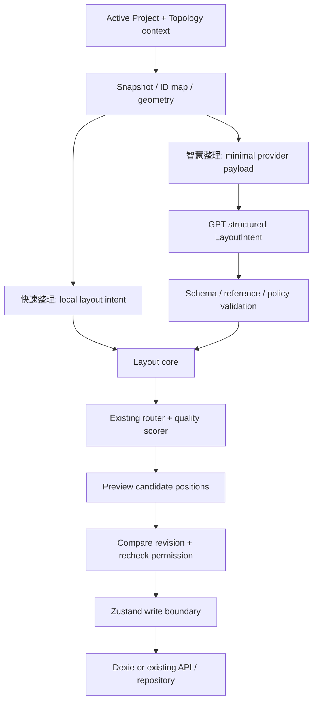

# Topology 功能與資料對接基線

- Primary Ticket：PM_AIL_001；設計承接：DSG_AIL_001
- Development Branch：codex/ai-layout-poc
- Worktree：C:/Users/DUS/Desktop/project/nettopo-studio/.local/worktrees/ai-layout-poc
- Base Commit：1b0b084518886cda347f175bfc959401fd1d18ed
- 日期：2026-09-11
- 性質：現況盤點＋已核准方向；「建議新增」不是現有功能。

## 功能與責任地圖

| 功能 | 現有來源 | 資料流／對接點 | AIL 責任 |
|---|---|---|---|
| Customer／Topology 選取及 CRUD | app/lib/topology-store.ts、app/api/topology/route.ts、db/topology-postgres.ts | TopologyRecord.project → active Project | 捕捉 topologyId；切換拓樸後丟棄舊結果 |
| Device／Link／Group 編輯 | app/page.tsx、app/lib/topology-types.ts、topology-validation.ts | 表單驗證 → setProject | 第一版只改已存在 Device.x/y |
| 模式選擇及自動整理 | app/page.tsx 的 layoutByMode/classifyThreeTier/classifySpineLeaf/layoutWithElk/autoLayout；app/lib/topology-layout.ts | auto-detect／three-tier／spine-leaf／layered → Project 座標 | 抽離純運算核心；兩個入口共用 |
| Canvas／Inspector | app/page.tsx、app/globals.css | Device/Link → controlled React Flow nodes/edges；Inspector explicit save | 比較候選、確認／取消、套用／復原 |
| 路由／anchor | app/lib/topology-routing.ts | Project＋node rect → view route | 呼叫既有 router；D09/D10 不變；不可保存 route points |
| 群組折疊 | app/lib/topology-visibility.ts、app/page.tsx | groupId/collapsed → view projection | 模型使用完整真實 graph，排除 synthetic collapsed node/edge |
| 拖曳 | app/page.tsx | transient node change → drag-stop setProject | 鎖定／前後比較不能誤觸 durable write |
| 持久化 | app/lib/topology-store.ts、topology-db.ts | setProject → credential strip/validation → Dexie 或 serverAction(saveProject) | 新增 compare-and-apply seam；沿用寫入邊界 |
| TXT／MD／CSV 匯入 | topology-document-parser.ts、topology-transfer.ts、topology-missing-info.ts | draft → validation → Preview → Project | 與 AIL preview 分離，不能混用 import apply |
| JSON／五檔 ZIP 匯出 | topology-transfer.ts、app/page.tsx | 目前 persisted Project → safe/full export | AI job/prompt/routes 不進 JSON/CSV |
| 身分／scope／憑證 | app/lib/server/pilot-request.ts、app/api/credentials、db/topology-postgres.ts | session → DB subject/site → resource policy | proposal 與 apply 各驗身分及 scope；不讀取 credential |

## Durable 欄位（base commit 的真實格式）

| 型別 | 欄位 | AIL 第一版可改 |
|---|---|---|
| Project | devices: Device[]、links: Link[]、groups: Group[] | 僅 devices 中既有 id 的 x/y |
| Device | id/name/type/x/y 必填；ip/mac/model/location/url/quantity/groupId 選填 | x/y；其餘保持相等 |
| Link | id/from/to/kind 必填；fromPort/toPort/vlan/speed 選填 | 無；from/to 是參照，不代表已證实單向流量 |
| Group | id/name/kind/color 必填；collapsed 選填；kind=site/domain/vlan | 無；不能用視覺整理重派 groupId |
| TopologyRecord | id/customerId/name/versionLabel/project/createdAt/updatedAt；siteId/ownerUserId/createdByUserId/updatedByUserId 選填 | 儲存時間依原流程更新；versionLabel 不是 concurrency token |
| Credential | 分離的 API/record/table | 完全排除，包括 masked credentials |

- DeviceType 共 15 種，沿用 topology-types.ts enum。
- group.kind=site 是圖面容器分類，不能當作 RBAC 的 TopologyRecord.siteId。
- 欄位限制以現有 Zod 為準：座標 finite 且 ±1,000,000；Project 上限 5,000 devices／20,000 links／1,000 groups。
- 上述 storage 上限不是 AI 處理上限。DSG 需訂獨立較小的 request/node/link/token limits。
- Link.medium 在此 base 不存在；由既有 MED 票鏈管理。AIL 不能自行加到 Zod/CSV。
- Device.x/y 是 topology 世界座標，不是螢幕像素；CSS 縮放、pan、panel size 不寫入 Project。
- node dimensions 目前引用 topology-routing.ts 的 178×112；後續幾何只能由共同 adapter 提供。

## 現有整理的已知對接缺口

1. autoLayout 現在 await 後直接 setProject，尚無候選預覽／撤銷契約；非同步結果可能已過期。
2. 三層／Spine–Leaf 分類與排版有部分留在 page.tsx；layout core 抽離須保留原模式語意。
3. setProject 回傳 void，持久化在背景執行；UI 不能把呼叫 setProject 等同 DB 已成功。
4. 現有 saveProject 沒有專用 expectedRevision 契約；多使用者 stale apply 不能僅靠 client hash 解決。
5. 欄位沒有可靠的 primary/backup/DMZ 定義，不能把模型推測寫成網路事實。
6. UIX_006–008 修正僅在 checkpoint dirty tree，見 BRANCH-MAP；AIL 的 Browser regression 必須依實際整合樹重新驗。

## 對接分層

## 驗證來源

base：tests/topology-layout.test.mjs、topology-routing.test.mjs、topology-routing-qa-uix.test.mjs、topology-visibility.test.mjs、topology-validation.test.mjs、topology-transfer.test.mjs。
跨樹候選：QA_UIX_002/003/004 的 Browser 證據只證明各自被測樹；整合後補 selection、resize、drag/reload 與 responsive 回歸。
